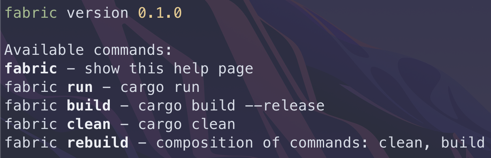
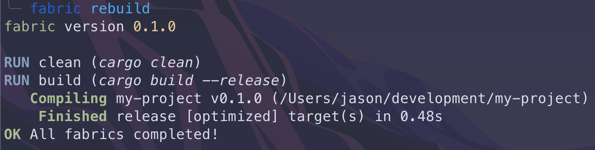

# Fabric 0.2.0 Beta

Fabric is a utility to simplify building processees across multiple languages.

Every language has it's own way to build/run the project and fabric aims to make
all of this possible with a single command and some configuration.

## `fabric` command

The fabric command can be used to list all possible sub-commands for the current
project or directory. (as long as there is a `.fabric` file)

In the image below is a set of sub-commands from an example project. in bold you
will see the sub-command and at the end a view of what will be executed on your system



Using fabric you can stop remembering how to setup/run/build every project when
you are working with multiple languages.

by having the same (style of) commands available regardless of what language or
framework you are using.

In the screenshot below there is a simple example for rust, in
this example `rebuild` is a 'collection' of `clean` and `build`



## `mk-fabric` command

The `mk-fabric` command can be used to create a `.fabric` file for a (new) project.

Usage:

``` sh
mk-fabric <dir: optional>

mk-fabric
mk-fabric ~/dev/my-project

mk-fabric --help
```

the `.fabric` file will come with some example commands to quicky start using
fabric with your project

## Configuration

To create a fabric project run `mk-fabric <dir: optional>` or simply create a
`.fabric` file in JSON format.

This file contains a list of `fabrics` which are available sub commands to the
fabric cli. i.e. `fabric build` where `build` is one of the fabrics.

A fabric must contain either a `command` with `args` or a list of `subfabrics`.

Subfabrics are a collection of fabrics (that must exist within the .fabric
project file).

The example below contains 2 fabrics (build, clean) and a combination of the two
using subfabrics:

_NOTE: this example is based on a rust project_

``` json
{
    "fabrics": [
        {
            "name": "build",
            "command": "cargo",
            "args": [ "build", "--release" ]
        },
        {
            "name": "clean",
            "command": "cargo",
            "args": [ "clean" ]
        },
        {
            "name": "rebuild",
            "subfabrics": [ "clean", "build" ]
        }
    ]
}
```

In this example `fabric build` will build the project and `fabric clean` will
clean up deps and built files.

Both of these can be run with a single command using `fabric rebuild` which runs
the subfabrics in the given order.

Also see the [template file](./template.fabric.json).

## Installation

Currently fabric is not available on crates.io or any package manager which
means you need to build it manually.

### Dependencies

only dependency is that you install [https://rustup.rs](https://rustup.rs).
which comes with the cargo cli.

_NOTE: after installing you still need to add the cargo bin to the `$PATH`
variable. you can copy-paste the command at the end of installation output_

### Building and installing

Start by cloning the project:

``` sh
git clone https://github.com/jasonverbeek/fabric-rs
cd fabric-rs
```

Next up we can build and/or install fabric with one of these commands:

``` sh
cargo build --release # to build without installing
cargo install # to build and install
```

If you decided to run `cargo build --release` you can find `fabric` in
the `./target/release` directory. you need to manually place this file
somewhere accessible.

However if you ran `cargo install` you can find `fabric` in the cargo bin dir,
assuming you correctly installed rustup and modified the `$PATH` variable you
can now use `fabric` and `mk-fabric`

## Changelog

[Changelog](./CHANGELOG.md)

